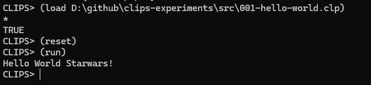

# clips-experiments
Code Kata with CLIPS (practices, explorations, experiments, tests or just playing)

## References
 - "CLIPS" Stands for "C Language Integrated Production System"
 - https://www.clipsrules.net/

 ## load, reset, run...
 
 Example 001-hello-world.clp
```
CLIPS> (load D:\github\clips-experiments\src\001-hello-world.clp)
CLIPS> (reset)
CLIPS> (run)
Hello World Starwars!
```
 